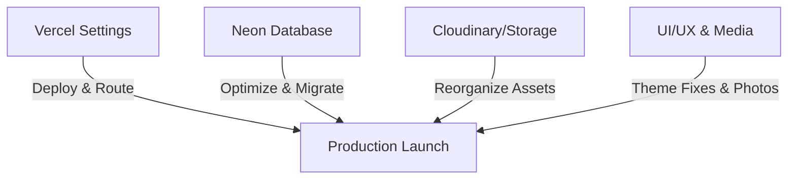

# AEC Academy English Center — Web Platform Roadmap

This document outlines the high-priority development, infrastructure, and design objectives for the **Academy English Center (AEC)** web platform. It serves to track planned improvements across hosting settings, database optimizations, asset storage structures, content parity, and UI/UX styling.

---

## 🗺️ Project Roadmap at a Glance

---

## 1. Vercel Hosting & Environment Configuration
Finalize routing, caching, and environment configurations to ensure optimal performance, proper redirection, and robust security headers.

- [ ] **Domain & Redirects Setup**
  - Configure automatic redirections from `www.academy.edu.vn` to the primary bare domain `academy.edu.vn`.
  - Set up canonical links and redirect legacy URLs from the old website to their corresponding new Next.js routes.
- [ ] **Caching & Performance Headers**
  - Implement optimal cache control headers in `next.config.ts` for static assets (`/public/logos/`, webp images).
  - Configure ISR (Incremental Static Regeneration) revalidation times for public pages (e.g., Homepage, Course catalog, Teachers list).
- [ ] **Environment Variable Alignment**
  - Audit and clean up duplicate environment variables between preview and production environments in the Vercel dashboard.
  - Securely store database connections (`NEON_DATABASE_URL`), OAuth client IDs, and CDN secrets.

---

## 2. Neon Database Optimization & Schema Simplification
Refactor and clean up the database schemas to improve query performance, reduce connection overhead, and streamline migrations.

- [ ] **Schema & Namespace Separation**
  - Audit the dual-schema structure (`elearning` and `public` schemas) in [schema.prisma](file:///d:/Projects/Mixed/AcademyWeb/prisma/schema.prisma).
  - Merge redundant tables and remove unused legacy models/fields to keep the schema clean and maintainable.
- [ ] **Performance Tuning & Indexing**
  - Add database-level indexes on frequently queried fields like `slug` in `Post`, and foreign keys in `CourseEnrollment`, `ClassSection`, and `Lesson`.
  - Enable Neon connection pooling (`DATABASE_URL` with pooled transaction strings vs direct connections for migrations) to handle spikes in concurrent users.
- [ ] **Data Migration Safeguards**
  - Run schema migrations through robust CI checks using schema-only staging branches.
  - Update `seed.ts` to reflect the updated schema models for easy local development setup.

---

## 3. Storage Infrastructure & Cloudinary Reorganization
Standardize file structures, optimize image compression, and ensure assets are easily accessible by developer and content editors.

- [ ] **Asset Folder Directory Restructuring**
  - Reorganize storage structures into logical folders matching our platform areas:
    - `/courses/` for course thumbnails and curriculums.
    - `/teachers/` for faculty avatars.
    - `/blog/` for post cover photos.
    - `/ui/` for custom background textures and decorative vector graphics.
- [ ] **Naming Conventions & Asset Pruning**
  - Enforce a lowercase, hyphen-separated naming standard (e.g., `ielts-prep-banner.webp`).
  - Audit R2/Cloudinary buckets to delete stale, unused files, and drafts.
- [ ] **Auto-Compression Pipeline**
  - Ensure all uploaded user content is converted to modern high-efficiency formats (WebP/AVIF) with preset responsive dimensions.

---

## 4. Public Pages Content & Media Enrichment
Transform placeholder layouts into rich, engaging showcases by deploying real, high-quality media representing the actual school community.

- [ ] **Authentic Media Acquisition**
  - Replace stock vector icons or placeholder images with high-resolution photos of real AEC students, classrooms, and teachers.
  - Curate classroom-in-action and event photographs to portray an optimistic, energetic, and student-centered community.
- [ ] **Course Page Enhancements**
  - Add actual program badges, detailed teacher cards, and classroom gallery sections to individual program pages (Kids, Teens, IELTS, and Corporate English).
- [ ] **SEO Optimization for Public Assets**
  - Add descriptive alternative text (`alt` tags) containing relevant keywords to all public images for improved Google search ranking.

---

## 5. UI/UX Polishing: Theme Consistency & Brand Alignment
Refine the color tokens and theme setups across dashboards and public pages to strictly match the **AEC Bright Learning System**.

- [ ] **Correcting Color Mismatches**
  - Enforce primary AEC orange (`#f68d2e`) and navy (`#2c2d65`) colors across all interactive elements (buttons, inputs, hover states).
  - Resolve dark-light theme unmatching:
    - Ensure public-facing pages default to a clean, bright-first, light-background design (per the brand identity).
    - Eliminate high-contrast dark sections that clash with the branding.
- [ ] **Component Font Standardization**
  - Confirm the Montserrat font family is correctly inherited by all third-party dashboard components (Shadcn, toolbars, tables, and dropdowns).
  - Standardize button border radii (e.g., pill buttons `.btn-primary` and rounded boxes `.card`) to create a cohesive shape system.